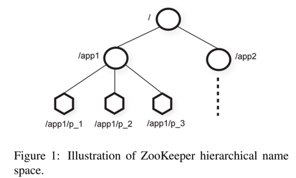
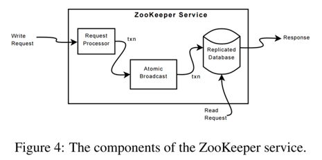
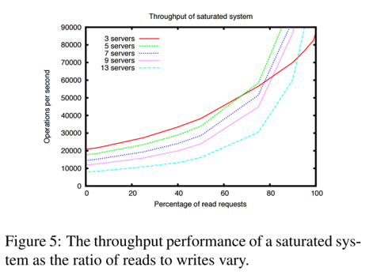
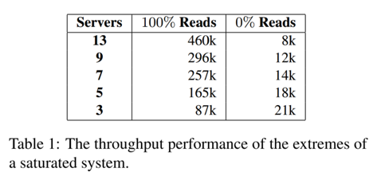
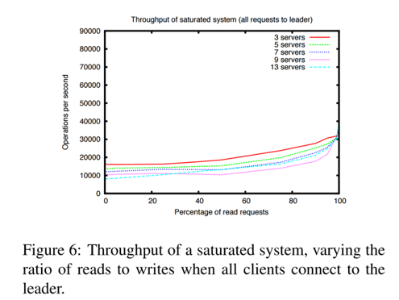
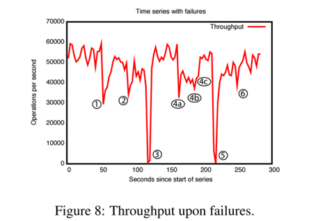
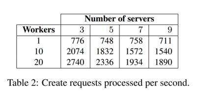
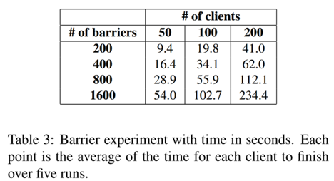

# ZooKeeper: 互联网系统无等待协调服务

标签： 分布式

# 摘要

本文描述分布式应用的协调服务：ZooKeeper。ZooKeeper是关键基础设施的一部分，其目标是给客户端提供简洁高性能内核用于构建复杂协调原语。在一个多副本、中心化服务中，结合了消息群发、共享注册和分布式锁等内容。ZooKeeper提供的接口有共享注册无等待的特点，与事件驱动的分布式系统缓存失效类似，还提供了强大的协调服务。

ZooKeeper接口提供了高性能服务实现。除了无等待特性，还提供了对于客户端请求消息FIFO执行顺序保证，以及改变ZooKeeper状态的所有请求的线性化保证。这样的设计保证了对于本地服务的读请求，可以用高性能处理管道实现。论文中给出了目标负载，2:1到100:1的读写比例，可以处理每秒1万到10万的事务。由于其高性能，客户端广泛使用了ZooKeeper。

# 1 简介

大规模分布式应用需要不同形式的协调程序，配置是一种类型。其最简单的形式，对于系统进程，配置有一个操作参数列表构成，当然对于更加复杂的系统还会有动态配置参数。群组成员和Leader选举也很常见：通常，需要知道哪些进程是否正常，哪些进程负责管理。对于实现互斥访问临界资源，锁是一个强大的协调原语。

协调的一种方式是对于不同的协调需求开发不同服务。例如，亚马逊简单队列服务仅仅用于队列实现，开发其它服务实现Leader选举和配置。实现了较强原语的服务可以用来实现较弱原语服务。例如，Chubby是保证强一致性的锁服务，锁服务可以被用来实现Leader选举、群组成员等。

设计协调服务时，从服务器端移除了与特定原语相关的部分，取而代之的是选择提供API给应用开发人员实现自己的原语。这一选择导致必须要实现一个*协调内核*，可以不用改变服务核心就能实现自己的原语。这种方式可以根据应用的需求实现多种协调，而不是给开发者固定的几种原语。

设计ZooKeeper API，移除了阻塞原语，例如锁。阻塞原语对于一个协调服务会引起其它问题，速度较慢或者故障的客户端会对速度较快的客户端产生负面的影响。如果处理的请求依赖于其它客户端的应答消息和故障探测，服务本身实现会更加复杂。ZooKeeper实现了操作类似于文件系统的简单无等待数据对象的API。实际上，ZooKeeper API与文件系统非常类似，ZooKeeper API与除去有锁方法open、 close的Chubby很像。实现无等待数据对象将ZooKeeper与那些实现了基于阻塞原语（如锁）的系统区分开来。

虽然无等待属性对性能和容错非常重要，但对于协调并不够。ZooKeeper对于操作还提供了顺序保证。特别地，保证所有操作*先进先出的客户端顺序*和*线性化写*能够实现高效服务，对于实现应用的协调原语也是足够的。实际上，对于使用API的任意数量的进程，都可以实现一致性，根据Herlihy给出的层次结构，ZooKeeper实现了全局对象。

Zookeeper服务包含几个副本组成的服务来实现高可用性和高性能。高性能使得包含大量进程的应用也可以使用这样的协调内核来管理所有协调的各个方面。可以使用单管道架构实现ZooKeeper，这种架构对于成百上千的请求仍然可以保证低延迟。这样的管道很自然地可以保证对于单个客户端所有操作执行的顺序性。FIFO客户端顺序使得客户端可以异步提交操作请求。使用异步操作，客户端可以同时处理多个未完成操作。这个特性是可取的，比如，当一个客户端成为了Leader，必须要操作元数据，根据需要对其进行更新。没有处理多个未完成操作的能力，初始化时间可能是秒的数量级。

为了保证更新操作满足线性化，实现了基于Leader的原子广播协议Zab。ZooKeeper应用的主要负载是读操作，所以需要保证读吞吐量的扩展性。在ZooKeeper中，服务器在本地处理读操作，并不需要使用Zab。

在客户端缓存数据是提高读性能重要技术，例如一个进程可以缓存当前Leader的ID，而不是每次都探测Leader。ZooKeeper使用watch机制使得客户端不需要直接管理客户端缓存。使用这一机制，对于一个给定的数据对象，客户端可以监视到更新，当有更新的时候收到通知消息。Chubby直接操作客户端缓存，会阻塞更新直到所有的客户端缓存都被改变。如果任何客户端速度较慢或者故障，更新都会延迟。Chubby使用租约防止客户端无限制阻塞系统。租约仅仅可以约束影响，ZooKeeper watches避免了这样的问题。

本文讨论ZooKeeper的设计和实现，使用ZooKeeper，可以实现应用所需的所有协调原语，只有写是线型化的。为了验证这一思路，我们展示如何使用ZooKeeper如何实现一些协调原语。

总的来说，本文主要贡献如下：
- **协调内核**：提出了一个无等待松散一致性的协调服务，描述了*协调内核*的设计和实现，并且在很多应用中使用其实现了各种协调技术。
- **协调示例**：展示如何使用ZooKeeper构建高级协调原语，阻塞和强一致性原语都是分布式系统经常使用的。
- **协调经验**：分享一些使用ZooKeeper的思路，评测其性能。

# 2 ZooKeeper服务

客户端使用API向ZooKeeper提交请求。除了提供客户端API，客户端库还提供了客户端与ZooKeeper服务器的网络连接。

在这一节，先看一下ZooKeeper的高级视图，然后讨论与ZooKeeper交互的API。

**术语**. 在本文中，使用*客户端*表示ZooKeeper服务的用户，*服务器*表示提供服务的进程，*znode*表示ZooKeeper数据的内存数据节点，znode以层次命名空间的方式组织起来称之为*数据树*。使用更新和写表示任意修改数据树状态的操作。当客户端连接到ZooKeeper时，会建立一个*会话*，然后获得会话句柄来提交请求。

## 2.1 服务概述

Zookeeper给客户端提供了数据节点集（znodes）抽象表示，数据节点集以层次化命名空间的形式组织。znodes是Zookeeper层次化结构中提供给客户端通过API操作的数据对象。层次化命名空间通常在文件系统中使用。因为用户经常会使用这一抽象，并且应用程序元数据也以这种方式更好组织起来，所以这是一种组织数据对象非常理想的方式。对于znode，使用标准UNIX文件系统路径记号。例如，使用/A/B/C给出znode C的路径，C的父节点是B，B的父节点是A。所有znodes都存储数据，除了临时znode，所有znode都可以有孩子节点。

客户端可以创建两种类型znode：
**普通**：客户端通过显示的方式创建删除普通节点。
**临时**：客户端创建这类节点，显式地删除或者系统在会话结束（主动结束或者因为故障结束）时自动删除。

创建新的znode节点时，也可以指定*sequential*标志，创建带有序号标志的节点会每次在创建一个节点时将单调递增计数器的值添加到名称后。如果n是新节点，p是父节点，n的序号值不会比在p下创建的任何序号节点的序号值小。

ZooKeeper实现了watches，其允许客户端无需轮询就能够及时接受到状态变化的通知信息。当客户端发送了带有watch标志的读请求时，操作会正常完成，但服务器会在数据发生变化时通知客户端。与一个会话关联的watches只会触发一次；一旦触发或者会话结束，就会被注销。比如，在/foo变更两次之前，客户端发送了 getData("/foo", true)，但客户端只会接受到一次/foo变化的通知信息。会话事件，例如连接断开也会被发送给watch回调，这样客户端就能够知道watch事件可能延迟。

**数据模型**。ZooKeeper使用简化API提供了基本的文件系统，只能一次读取或写入所有数据，或者带有层次的键值表。层次命名空间对不同应用的命名空间分配子树很有用、并且对子树设置访问权限也比较方便。在客户端可以利用目录结构构建高级原语，如2.4所示。

与文件系统不一样的是，设计znode不是用来保存通用数据，znode用来映射客户端应用的抽象，主要是对于协调用途的元数据。如图1所示，两棵子树，一个对应应用1，一个对应应用2，应用1的子树实现实现了一个简单群组关系协议：每个客户端进程Pi在/app1下创建znode p_i，p_i表示进程在运行。

尽管znode没被设计成存储通用数据，但在分布式计算中可以用其来保存用于元数据或者配置信息。例如，在基于Leader的应用中，对应用服务而言，确定当前的Leader很有用。为了实现这一目标，可以使用当前Leader将信息写入znode空间的一个已知位置，znode也可以将时间戳和版本计数与元数据关联起来，这样客户端就可以跟踪znode的变化，并且可以根据znode版本变化执行有对应的更新操作。

**会话**。客户端连接ZooKeeper初始化一个会话。会话有超时时间。当超时时间到期之后，ZooKeeper认为客户端故障。客户端关闭之后或者ZooKeeper探测到客户端故障之后，会话就终止。在会话内，客户端可以观察到持续的状态变化，这些状态变化反映了有操作在执行。会话使得客户端在可以ZooKeeper服务器集合中透明地从一个服务器移动到另一个服务器。

## 2.2 客户端API

下面给出了ZooKeeper API的一个子集，讨论每个请求的语义。

**create(path, data, flags)**：
使用path名称创建一个znode节点，保存data，并且新的znode的名称。 flags 用于创建常规的或者临时节点，也可以设置顺序标志。

**delete(path, version)**： 
删除指定path和version的znode节点。

**exists(path, watch)**： 
如果指定path的znode存在则返回真，如果不存在则返回假。watch标志用于在znode上设置监视器。

**getData(path, watch)**： 
返回数据和元数据，如版本信息。watch标志与exists()的watch标志一样，但如果znode不存在ZooKeeper不会设置监视器。

**setData(path, data, version)**： 
根据path和version将数据写入到znode。

**getChildren(path, watch)**： 
返回znode所有子节点的名称集合。

**sync(path)**： 
在操作开始时，等待所有等待的更新操作发送到客户端连接的服务器。path被忽略。

所有方法有同步和异步两个版本，当一个应用只需要执行单一操作，并且没有其它并发任务执行时，可以使用同步API，这样对于ZooKeeper调用和阻塞是必须的。异步API，可用用来实现多个未完成操作，并且有其它任务正在运行。客户端保证每个操作对应的回调被顺序调用。

ZooKeeper不使用句柄来访问znode，每个请求包含znode的路径，这种实现方式不仅可以简化API（没有open和close操作），而且减少了额外需要服务器维护的状态。

每次的更新都是对给定版本的更新，这样实现了有条件的更新，如果实际版本号与期望的版本号不一致，更新操作就会失败。如果版本号为-1，不会检查版本号。

## 2.3 ZooKeeper保证

ZooKeeper有两个基本的顺序保证：
**线性化写入**： 所有更新ZooKeeper状态的请求都是序列化的并且遵守优先级。
**先进先出客户端顺序**： 对于一个客户端的所有请求，都会按客户端发送的顺序执行。

这里定义的线性化与Herlihy最初提出的线性化有所不同，我们称之位异步线性化。Herlihy最初定义的线性化是一个客户端每次只能有一个未完成的操作（一个客户端是一个线程）。我们的异步线性化，可以允许一个客户端有多个未完成的操作，因此对于同一客户端需要保证先进先出的顺序。可以观察到，对于保持线性化对象也会保持异步线性化，因为满足异步线性化的系统也会满足线性化。因为仅仅更新请求是异步线性化的，所以ZooKeeper可以在每个副本本地处理读请求。这样，当服务器添加到系统时，服务可以线型扩展。

为了说明两个保证如何交互，考虑下面的场景。有多个进程组成的系统需要选举一个Leader指挥工作进程，当新Leader接管系统时，其需要变更很多配置参数，当其完成时，需要通知其它进程。下面的两个需求很重要：
- 新Leader开始更新时，其它进程还不能使用更新的配置；
- 如果新Leader在配置全部更新完成前挂死，其它进程不能使用部分更新的配置。

分布式锁，如Chubby提供的锁，可以满足第一个需求，但第二个无法满足。使用ZooKeeper，新Leader可以指定一个path作为*就绪*znode，如果就绪znode存在，其它进程可以使用配置。新的Leader通过删除就绪znode的方式更新各种配置znode，然后创建就绪znode。所有的这些变更可以管道化，并且可以异步提交来快速更新配置状态。尽管变更操作的延迟是2毫秒的数量级，如果请求是一个接一个方式提交，那么新Leader更新5000个不同的节点需要10s，如果请求是异步方式提交，处理时间少于1s。因为顺序的保证，如果进程查看到了就绪节点，就会看到新的Leader已经完成了全部更新。如果新Leader在创建就绪节点之前挂了，其它进程也会知道配置没有更新完成，也不会使用。

上面的模式仍然有问题：如果在新Leader开始更新之前，一个进程查看到就绪节点已经存在，但Leader恰好已经开始在更新配置了，这时会发生什么？这个问题可以使用通知的顺序性保证解决，如果客户端监视到变更，在其看到新的状态之前会收到通知事件。因此，如果读取就绪节点请求的进程收到了节点变化的通知，在可以读取新的配置之前，该进程会收到变更通知。

客户端除了与ZooKeeper之外还有其它通讯通道时，就会有新的问题。例如，客户端A和B共享配置信息，通过共享的通讯通道进行通讯，如果A变更了配置，B重新读取时会看到变化。如果B的ZooKeeper副本比A的稍微有延迟，则B不会看到更新。使用上面的保证，B可以通过写入请求在重新读取之前确保看到最新的信息。为了更加有效的处理这一场景，ZooKeeper提供了sync请求：当读取时，就是一次慢读取。sync操作不需要一次完全的写操作负载就可以在读之前使得服务器将所有等待的写请求完成。这一原语与ISIS的原语flush类似。

ZooKeeper有下面的两个活性和持久性保证：如果ZooKeeper的大部分服务器状态OK，与服务通信就是可用的；如果ZooKeeper服务对于变更请求能成功响应，只要服务能够最终回复，变更也会被持久化到故障服务。

## 2.4 原语的例子

在这一节，使用API实现更多更加强大的原语。ZooKeeper服务不会知晓高级原语的任何信息，因为其完全通过客户端API实现，一些通用原语如群组关系和配置管理也是无等待的。对其它原语而言，如会合，客户端需要等待。尽管 ZooKeeper 是无等待的，但也可以实现阻塞原语。ZooKeeper的顺序保证系统状态的有效性，监视器保证是有效的等待。

**配置管理** ZooKeeper可以用来实现分布式应用的动态配置。以最简单的形式来描述，配置信息保存在节点Zc中，进程使用全路径Zc启动，并且watch标志设为真。如果在Zc中的配置被更新，进程会被通知，然后读取新的配置信息，重新设置watch标志位真。

在这种模式中及其它的使用监视器的模式中，监视器用来确保进程有最近的信息。例如，如果一个进程监视Zc，被通知Zc的变化，并且在其发送读请求给Zc之前，对Zc又有三次更新，进程不会收到三次通知事件。这不会影响进程的行为，因为这三个事件通知对该进程而言已经知道了：Zc的信息是过时的。

**信息汇合** 在分布式系统中，有时对于系统的最终的配置信息并不能提前知道，例如，客户端要启动一个主进程和几个工作进程，但启动进程由调度器完成，所以客户端不能提前知道相关信息，如用于工作进程连接主进程的IP和端口。对于这种场景，可以通过客户端创建一个信息汇合节点Zr。客户端将Zr全路径作为主进程和工作进程的启动参数。当主进程启动时，可以将IP地址和端口信息写入Zr，工作进程启动时，读取Zr并将watch标志设置为真。如果Zr没有并填充内容，则工作进程等待直到Zr被更新，如果Zr是一个临时节点，当客户端结束时，主进程和工作进程可以通过检视Zr是否被删除对自己进行清理。

**群组关系** 利用临时节点可以实现群组关系。通过临时节点可以查看创建节点的会话信息。设计一个Zg的节点表示组，这个组的成员进程启动时，在Zg下创建一个临时节点，如果每个进程有唯一的名字或ID，可以用来代表这个子进程，如果没有唯一的名字则可以通过顺序标志分配一个唯一的名称。进程会将一些信息放到子节点中，如地址和端口。

子节点创建后，进程启动。如果进程故障或者终止，不需要其它处理，标示其的znode自动会被删除。

通过列出Zg的所有子节点，进程可以获取群组信息。如果进程监视群组变化，可以设置watch标示，收到通知时刷新群组信息。

**简单锁** ZooKeeper不是一个锁服务，但可以用来实现锁。使用ZooKeeper的进程会经常使用根据其需求裁剪过的同步原语。通过ZooKeeper实现锁来说明它可以实现各种通用的同步原语。

简单锁实现使用了“锁文件”。用一个znode表示锁。客户端尝试创建一个带有临时标志的节点来获取锁。如果创建成功，客户端可以持有该锁。如果创建失败，客户端设置watch标志读取znode，如果当前使用锁的leader终止，会通知客户端。客户端在终止或显示删除znode来释放锁，其它等待的客户端重新尝试获取锁。

虽然简单锁协议可以工作，但还有一些问题。首先，有群体效应问题，如果很多客户端等待锁，对这个锁的竞争就会很激烈，当锁释放时，仅仅有一个等待的客户端获得锁。其次，仅仅实现了互斥锁。下面两个原语客服了这些问题。

**无群体效应的简单锁** 定义一个znode（l）来实现，将所有客户端按请求顺序排列，依次获得锁。希望获得锁的客户端做如下的操作：

  **lock**

    1 n = create(l + “/lock-”, EPHEMERAL|SEQUENTIAL)
    2 C = getChildren(l, false)
    3 if n is lowest znode in C, exit
    4 p = znode in C ordered just before n
    5 if exists(p, true) wait for watch event
    6 goto 2
    
  **unlock**

    1 delete(n)

在lock第1行中，使用顺序标志将所有获取锁的客户端排序。如果客户端有最小的序号，则获得锁，否则，客户端等待删除已经获得锁或者这个客户端之前接受锁的znode。通过监视先于客户端的znode，当释放锁或者放弃锁请求时，一次唤醒一个客户端，这样就避免了群体效应。一旦监视的znode不存在，客户端要检查是否获得了锁。（前面的锁请求会被放弃，有一个小序号的znode还在等待锁。）

释放锁的操作很简单，删除代表了锁的znode即可。创建节点时使用临时标志，进程崩溃时会自动锁请求释放所有的锁。

总结一下，锁模式有下面的有下面的优点：
1. 移除一个znode仅仅会唤起一个客户端，因为每个znode只会有一个客户端监视，避免了群体效应。
2. 没有轮询或超时。
3. 因为实现方式，可以通过浏览ZooKeeper数据观察锁的竞争，解锁，调试锁。

**读写锁** 为了实现读写锁，稍微改一下前面的锁步骤即可，将其分解为读锁和写锁，释放锁的过程与前面全局锁一样。

  **write lock**

    1 n = create(l + “/write-”, EPHEMERAL|SEQUENTIAL)
    2 C = getChildren(l, false)
    3 if n is lowest znode in C, exit
    4 p = znode in C ordered just before n
    5 if exists(p, true) wait for event
    6 goto 2

  **read lock**

    1 n = create(l + “/read-”, EPHEMERAL|SEQUENTIAL)
    2 C = getChildren(l, false)
    3 if no write znodes lower than n in C, exit
    4 p = write znode in C ordered just before n
    5 if exists(p, true) wait for event
    6 goto 3

这个锁过程与前面锁稍微有点差异，写锁仅仅命名不一样。读锁可以共享，第三、四行稍微变了一下，如果前面有写锁就不能获得读锁，当一些客户端等待读锁时，如果写锁被删除了，似乎会出现群体效应，实际上这种情况是正常的情况，所有客户端可以获得锁同时读取。

**双屏障** 双屏障能使客户端在计算开始和结束时进行同步。通过屏障阈值定义进程个数，当有足够多进程加入到屏障后，开始启动计算，计算结束时离开屏障，在ZooKeeper中使用一个znode（b）来表示屏障。每个进程p进入时创建b的子节点向b注册，当进程离开时删除子节点向b注销。在所有进程移除了子节点后进程可以退出屏障。使用监视器等待进入和离开的条件满足。进入时，进程监视b的就绪节点是否存在，这个节点由进程满足屏障阈值的那个进程创建，离开时，监视一个特殊子节点是否消失，一旦子节点被移除，仅检查退出条件即可。

# 3 ZooKeeper应用

这一节给出使用ZooKeeper的应用，并给出如何使使用的简要介绍。使用黑体字表示每个示例的原语。

**爬取服务** 搜索引擎的一个重要部分是爬虫，雅虎爬取了数10亿的网页文件，爬取服务（FS）是雅虎雅虎爬虫的一部分，并且已经用于生产环境，有一些主进程向页面爬取进程发送指令，主进程向爬取进程提供配置，爬取进程写回其状态信息。FS使用ZooKeeper的主要目的是主进程的故障恢复，这样即使有故障也可以保证可用性，将客户端与服务器解耦，读取状态信息就能将请求指向健康服务。FS使用ZooKeeper的主要作用是管理**配置元数据**，还用于**选举主进程**。

图2给出了FS使用3天的一个ZooKeeper服务器的读写流量，为了生成这张图，计算了周期内每秒的操作数，每个点表示一秒的操作数，读取流量要比写入流量高很多。在周期内，每秒的速率高于1000个操作，读写比例在10:1到100:1之间变化。读的工作负载主要是getData(), getChildren()和exists()，并且依次递增。

**Katta** Katta是一个使用ZooKeeper作为协调器的分布式索引服务，是一个非雅虎的应用例子。Katta将任务进行分片索引。主服务给从服务分片并跟踪进度。从服务故障后，主服务必须要重新分布负载给从服务。主服务也可能故障，其它服务器必须时刻准备接管。Katta使用ZooKeeper跟踪主从服务的状态（**群组关系**）然后处理主服务的故障转移（**leader选举**）。Katta还使用ZooKeeper跟踪分发分片任务给从服务（**配置管理**）。

**雅虎消息协商器** 雅虎消息协商器（YMB）是一个分布式发布-订阅系统，系统管理成千的主题用于客户端发布订阅消息和接受消息。主题分发给一系列提供可伸缩性的服务。梅特主题使用主备复制模式来保证消息被复制到两个服务器，这样可以保证消息的可靠投递。YMB服务器使用share-nothing的分布式架构，其组成了保证正确操作的基础。YMB使用ZooKeeper管理主题的分发（**配置管理**），在系统中处理机器故障（**故障探测**和**群组关系**），和控制系统的运行。

图3给出了YMB部分znode数据布局，每个协调器域有一个nodes的节点，组成YMB的每个活动服务器都有一个临时节点。每个YMB服务器在nodes下面创建一个临时节点，临时节点包含负载和状态信息用于提供群组关系和状态。例如shutdown和migration_prohibited节点被所有服务器节点监视，允许YMB的中心控制。topics目录对于每个主题都有一个子节点。这些主题节点有子节点，用于表示主题订阅者每个主题的主备服务，主和备服务节点不仅允许服务器控制主题的服务器，而且还管理leader选举和服务器宕机。

# 4 ZooKeeper实现

ZooKeeper通过复制ZooKeeper数据给所有ZooKeeper服务提供了高可用。假设服务器宕机，这个故障服务器可以随后回复。图4给出了ZooKeeper高层组件。在收到请求时，一个服务准备执行（请求处理器）。如果这个请求需要在服务器之间协调（写入请求），需要使用一致性协议（原子广播的一个实现），最后服务器提交请求给在所有服务之间复制的ZooKeeper数据库。对于读请求，一个服务读取本地数据库的状态生成请求的响应消息。

副本数据库是内存数据库，保护了整个数据树。树种的每个节点存储默认最大1MB的信息，最大值是可配置的，并且可以根据特殊使用情况变更。为了保证恢复，将更新高效写入磁盘，在写入内存数据库之前，会强制写入磁盘。如Chubby，使用replay日志（在我们的例子中是写前日志）将提交的请求记录生成内存数据库周期快照。

每个ZooKeeper服务器服务几个客户端。客户端连接一个服务器提交请求。如前所述，读请求在服务器数据库的本地副本上进行。对于改变服务状态的写请求，通过一致性协议处理。

作为一致性协议的一部分，写请求被定向给单个服务，称之为leader。其余的服务称之为followers，收到从服务发来的构成状态变化的消息提议，并且同意状态变化。

## 4.1 请求处理器

由于消息层是原子的，可以保证本地副本不会出差错，虽然子啊任何时刻一些服务可能比其它服务处理的事务多。不像从客户端发送来的请求，事务是幂等的。当Leader收到写请求，会计算系统写入后的状态并且将其转化为捕获新状态的事务。未来状态必须计算，因为可能会有未写入到数据库的事务。例如，一个客户端使用带有条件的setData，请求中的版本信息匹配了更新后的znode的版本信息，服务器生成包含新数据、版本号和更新后的时间戳的setDataTXN。如果异常发生，不匹配版本号或者将要更新的znode不存在，会生成errorTXN。

## 4.2 原子广播

所有更新ZooKeeper状态的请求被定向到leader。leader执行请求并且通过原子广播协议Zab广播变更信息。服务器收到客户端请求后，当成功发送状态变更后，给客户端发送响应。Zab默认使用简单的多数服从原则，所以如果大部分服务器正常时（例如，对于2f+1个服务器，可以允许f个故障）Zab和ZooKeeper就会正常工作。

为了获得高吞吐量，ZooKeeper尽量保持请求处理管道是满的，在处理管道不同部分会有成千的请求，因为状态变化依赖前面状态变化，Zab提供强一致性保证，Zab保证发送请求顺序广播，所有前leader的变更请求会在其自己状态变更之前广播。

有一些实现细节简化了实现过程并且提供了高性能，使用TCP传输，消息顺序通过网络保证。使用Zab选择的Leader作为ZooKeeper Leader，所以一些创建事务的进程处理这些事务。对于内存数据库使用日志跟踪协议作为写前日志，这样不需要讲消息写入磁盘两次。

在操作过程中，Zab按顺序发送所有消息，兵器仅发送一次，但如果Zab对每个发送的消息不永久记录id，Zab可能在恢复阶段再次发送消息。因为使用幂等的事务，只要按顺序发送，多次发送也是可以接受的。实际上，ZooKeeper需要Zab在最后一次快照之后发送的所有消息重新发送一次。

## 4.3 副本数据库

每个副本都在内存中有一份ZooKeeper状态的拷贝，当ZooKeeper从故障中恢复时，需要恢复其内部状态。当服务器运行一段时间之后，重新发送所有消息恢复状态需要很长时间，所以ZooKeeper使用周期性的快照，每次只需要重新发送从快照开始的消息。将ZooKeeper快照称之为fuzzy快照，因为不需要锁定ZooKeeper状态来生成快照，使用深度优先扫描树，读取znode的数据和元数据并写到磁盘。虽然最终的fuzzy快照可能会包含状态变化的子集，因为在生成快照的时候也可能会有状态变化，结果与ZooKeeper某个状态不一致，但只要顺序写入状态变更消息，由于是幂等的，可以进行变更两次。

例如，假设ZooKeeper数据树节点/foo和/goo搁置有f1和g1，fuzzy开始时版本号都是1，下面的状态变化流用形式 < transactionType, path, value, new-version >:

    < SetDataTXN, /foo, f2, 2 >
    < SetDataTXN, /goo, g2, 2 >
    < SetDataTXN, /foo, f3, 3 >

在处理这些状态变更之后，/foo和/goo的值变为f3和g2。但fuzzy可能记录/foo和/goo有f3和g1，版本分布为3和1，这种状态不是ZooKeeper数的最终状态，如果服务器宕机从快照恢复，Zab重新发送状态变更，最终保证与宕机前的服务状态一致。

## 4.4 C/S交互

当服务器处理写请求时，也会将更新相关的通知发送出去并清空。服务器按顺序处理写请求，并且不会同时并发地处理其它的写或读请求，这保证了通知的严格一致，服务器在本地处理通知。仅仅客户连接的服务器跟踪触发通知消息。

读请求在每个服务器的本地进行，每个读请求使用zxid标记，zxid与服务器看到的最后一次事务一致。zxid定义了关于写请求部分读请求的顺序。通过在本地处理读请求，可以获得非常高的读性能，因为是本地服务器的内存操作，没有磁盘活动和一致性协议运行。这一设计对以读为主的工作负载可以满足高性能的目标。

一个不足的地方是读请求不能保证读请求的优先级顺序，读操作可能读取到旧的状态信息，虽然最近有更新被提交。不是所有应用需要优先级顺序，对于那些需要优先级顺序的应用，提供了sync实现。这个原语异步执行，并且由leader在挂起的写操作全部写入到本地副本之后执行。为了保证对于读操作返回最新的数据，客户端在读操作后立即调用sync。先进先出顺序保证客户端顺序保证以及sync的全局顺序保证，保证sync之前的所有变更都会被反应到读请求的结果中。在我们的实现中，不需要自动广播sync操作，因为使用了基于leader的算法，仅将sync操作放到请求队列的末尾，在leader和服务器之间。为了保证工作，follower必须保证leader仍然是leader。如果有未提交的事务，服务器就不能怀疑leader。如果挂起队列是空的，leader需要提交一个空事务，完成后执行sync操作。着保证了leader在低负荷时没有额外的广播流量生成。在实现时，设置超时，这样leader就能在follower抛弃其之前知道，不需要提交空事务。

ZooKeeper服务器以先进先出的顺序处理请求。应答包含了zxid。心跳消息包含最后一个zxid，如果客户端连接到新的服务，新服务器通过检查客户端的最后一个zxid和其自己的zxid，保证ZooKeeper数据视图是最新的。如果客户端有比服务器更新的视图，服务器不在重新建立会话。客户端保证能够找到其它有新视图的服务器，因为客户端仅仅看到变更被复制到了大部分服务器上。这一行为对保证持久性很重要。

为了探测到客户端会话故障，ZooKeeper使用了超时机制。如果没有其它服务器可以从客户端会话收到消息，leader确定有故障发生。如果客户端经常发送请求，则不需要发送其它消息。否则，客户端在低活跃期发送心跳消息。如果客户端不能与服务器通信或发送心跳，会重新连接到其它服务器重新建立会话，为了防止会话超时，在会话空闲s/3ms后发送心跳，然后在2s/3ms后没有收到消息就转向新服务器，这里s是用毫秒表示的会话超时时间。

# 5 测评

在50个服务器上进行了测评，每个服务器的规格是Xeon双核2.1GHZ处理器，4GB内存，千兆以太网和两个SATA硬盘。分两个部分讨论：吞吐量和请求延迟。

## 5.1 吞吐量

为了测评系统，以系统饱和时的吞吐量和注入各种故障时吞吐量的变化作为基准。变更组成ZooKeeper服务的服务器个数，但客户端个数保持不变。为了模拟大量客户端，使用35个机器来模拟250个并发客户端。

用Java实现ZooKeeper服务，客户端有Java和C两种。配置Java服务器写日志文件到一个专用的磁盘，在另一个磁盘上进行快照。基准客户端使用异步Java客户端API，每个客户端至少有100个未处理请求，每个请求由一个读或写1K数据的操作组成，因为所有修改状态的操作都是近似的，所以没有给出其它操作的基准测试，所有不修改状态的操作，除了sync也是近似相同。（sync的性能与轻量写操作近似，因为请求必须到达Leader，但不需要广播。）客户端发送每300ms发送所有的全部操作，每6s进行一次采样。为了防止内存溢出，服务器抑制并发请求的数量。ZooKeeper使用请求抑制来防止服务器崩溃。碎玉这些实验，配置ZooKeeper服务器在进程上最多有2000个请求。

在图5中，改变读写比例请求观察吞吐量， 每个曲线对应提供ZooKeeper服务的服务器个数。表1给出了读负载的极限。读吞吐量比写吞吐量高，因为读不需要原子广播。图中还给出服务器个数对广播协议性能有负面影响，从图中可以看出，服务器个数不仅影响服务器可以处理的故障数量，还影响服务器可以处理的负载。三个服务器的曲线与其他相比大约在60%，这种情况不排除三个服务器配置，对所有配置并行本地读开启都一样。在该图中，不能观察到其它配置，因为已经比y轴的最大的吞吐量还要大。

写比读需要更长时间主要是两个因素造成的，第一，读请求必须通过原子广播进行，这需要一些额外处理增加了延迟。第二，服务器必须保证在发送确认信息给Leader之前，事务被记录到非易失存储器中。原则上来说，这个要求有点强，但对于生产系统，需要权衡性能和可靠性，因为ZooKeeper组成了应用。使用更多服务器可以容纳更多服务故障，通过将ZooKeeper服务器分区可以提升写吞吐量，在副本和分区之间的这一性能权衡，之前Gray等人已经做了验证。

ZooKeeper可以通过分布负载给其它服务器来提供高吞吐量，因为松散一致保证，可以分布负载。Chubby客户端将所有的请求发给Leader，图6给出如果不使用这一条件并且强制客户端连接到Leader。与期望一样，吞吐量比读分布到其它服务器上的方式要低，但对于全部写，吞吐量也比较低。影响Leader的能力的额外CPU和网络负载用于协调广播协议，反过来影响全部的写操作性能。

原子广播协议完成系统中的大部分工作，所以比较其它组件而言，它限制了ZooKeeper的性能。图7给出了原子广播组件的吞吐量。为了测试其性能，通过在Leader上直接生成事务的方式模拟客户端。以最大的吞吐量，原子广播组件成为CPU瓶颈。理论上来说，图7中的性能与ZooKeeper 100%写入操作的性能一致。ZooKeeper客户端通信，ACL检查，事务转换请求都需要CPU处理，关于ZooKeeper吞吐量CPU降低的主要原因还是在于原子广播组件。因为ZooKeeper是关键生产组件，到目前为止ZooKeeper的主要开发集中在正确性和鲁棒性。有许多方法可以影响性能，比如额外拷贝，同一对象的多序列化，更搞笑的内部数据结构等。

为了给出注入故障后随时间系统的行为，使用由5个服务器组成的集群。与前面一样也是饱和的基准测试，但这次写请求保持30%，对于我们期望的工作负载，这是一个保守的比例。周期性低杀死一些服务，图8给出系统随时间变化的吞吐量。图中标示的事件解释如下：
1. 一个Follower故障和恢复
2. 另一个Follower的故障和恢复
3. Leader故障
4. 两个Follower故障（a，b），第三个标志出恢复（c）
5. Leader故障
6. Leader恢复

从图中可以观察出一些重要信息，第一，如果单个Follower故障，并快速恢复，ZooKeeper能支撑高吞吐量。单个Follower不会导致真个系统故障，仅仅降低了在故障前服务处理共享读请求的吞吐量。第二，Leader选举算法能够保证快速恢复，避免系统吞吐量下跌。根据观察，ZooKeeper需要少于200ms时间选出新的Leader，所以，尽管服务器有几百ms停止服务请求处理，但因为我们的采样周期没有观察到0吞吐量。第三，即使Follower需要较长时间恢复，一旦启动请求处理，ZooKeeper就能够提升吞吐量。在事件1,2和4之后没有恢复全部吞吐量的原因是客户端仅仅仅仅转换可Follower，当其与原有的Follower断开之后，因此，在事件4之后，客户端可以重新分配直到Leader在3,5处故障。根据实际情况，这种不平衡在客户端增删过程中随时间会消失。

## 5.2 请求延迟

为了评估请求的延迟，创建了以Chubby基准为模型的测试。创建一个工作进程发送创建请求，等待结束，发送异步删除请求，然后进行下一个创建。根据情况改变工作进程的个数，每次运行时每个工作进程创建5万个节点。通过创建请求完成个数除以所有工作进程需要的总时间计算吞吐量。

表2给出基准测试的结果，创建请求包含1K的数据，而不是Chubby的5字节，这样做是为了与我们实际期望使用的情况一致。虽然请求数据更大，ZooKeeper的吞吐量是Chubby公开发表的吞吐量的3倍。单个ZooKeeper工作进程基准测试吞吐量表面平均的请求延迟对于3个服务器是1.2ms，9个服务器是1.4ms。

## 5.3 屏障的性能

在这个实验中，执行几个屏障来评价用ZooKeeper实现的原语的性能。对于给定的屏障个数b，每个客户端第一次进入所有的b个屏障，然后离开所有的b个屏障。使用2.4节中的双屏障算法，在进入下一次调用之前（leave())之前，客户端第一次等待所有其他客户端执行enter()过程。

实验结果如表3所示，在这个实验中，有50,100和200个客户端相继进入b个屏障，b属于{200, 400, 800, 1600}。尽管应用程序可以有成千的ZooKeeper客户端，通常情况下，很小一部分参与每个协调操作，因为客户端根据特定的应用进行分组。

这个实验中可以看到两个有意义的信息，处理所有屏障的时间大致随屏障的个数线型增长，同时访问数据树的相同部分不会产生任何非期望的延迟，延迟延迟随着客户端数量按比例增加。这是服务不饱和的结果。实际上，可以看出，虽然客户端使用锁，在所有情况下每秒处理的操作在1950到3100之间。在ZooKeeper运行中，这与每秒10700到17000吞吐量一致。在实现时，读写比例是4:1（80%读操作），基准测试代码使用的吞吐量与原始的ZooKeeper可以得到的吞吐量（根据图5超过40000）要低，这是因为客户端在等待其它客户端。

# 6 相关工作

ZooKeeper的目标是提供一个服务用于减少在分布式应用中协调进程的问题。为了实现这一目标，设计使用了一些来自已有的协调服务，容错系统，腹部是算法和文件系统的思想。

这篇文章并不是第一个提出分布式应用的协调服务，一些更早的系统提出了对于事务应用的分布式锁服务，用于在集群计算机中共享信息。更近一点，Chubby提出了一个系统用于管理分布式应用的锁，Chubby与ZooKeeper的一些目标一致。其也有与文件系统类似的接口，只用一致性协议保证副本的一致性，但ZooKeeper不是锁服务，客户端可以使用ZooKeeper实现锁服务，但API中没有锁操作，与Chubby不一样的是，ZooKeeper允许客户端连接到非Leader的ZooKeeper服务器，ZooKeeper客户可是使用本地副本来提供数据和管理监视器，因为其一致性协议比Chubby的更松，这使得ZooKeeper提供了比Chubby更高的性能，并且允许应用使用ZooKeeper更多的扩展。

有一些资料提出了容错系统，以减少构建容错分布式应用的问题。一个早期的系统时ISIS，ISIS系统将抽象类型规范转换为容错的分布式对象，使得容错机制对于用户是透明地。Horus和Ensemble是从ISIS发展而来。ZooKeeper采用了ISIS的虚同步的思想，最后，Totem使用局域网硬件广播在架构上保证消息传送的顺序性。ZooKeeper可以以多种网络拓扑工作，这依赖服务器进程之间的TCP连接，而不是任何特殊的拓扑或硬件特性。这里，还没有给出ZooKeeper内部使用的整个通信机制的任何信息。

构建容错服务的一个重要技术是状态机副本，Paxos是一个异步系统保障副本状态机非常有效的算法。使用了一个与Paxos有一些类似特征的算法，但结合了保持一致性的事务日志和用于数据高效恢复的写前日志记录。有一些提出了拜占庭容错复制状态机的实际实现的协议。ZooKeeper不假定服务器是拜占庭式的，但使用了了如校验和和正常性校验的机制来捕获非恶意的拜占庭故障。Clement等人讨论了不修改当前服务器代码来实现完全的拜占庭容错。到现在，并没有观察到生产环境中使用完全的拜占庭容错协议避免的故障。

Boxwood是使用了分布式锁服务的系统。Boxwood给应用提供了高级的抽象，其依赖基于Paxos的分布式锁服务。与Boxwood一样，ZooKeeper是一个用于构建分布式系统的组件，ZooKeeper有高性能的要求在客户端应用中使用更加广泛。ZooKeeper提供给了低级原语，应用可以使用这些原语实现高级原语。

ZooKeeper与一个小型的文件系统类似，但仅仅提供了文件系统操作的一个子集，但加入了一些大多数文件系统不具备的功能，如顺序性保证和条件写入。ZooKeeper监视器与ATS的缓冲回调类似。

Sinfonia使用了mini事务，这是一个构建可伸缩分布式系统的新的模型，Sinfonia被设计用于保存应用数据，ZooKeeper用于保存应用元数据，ZooKeeper保存状态副本在内存中，保证系统高性能和consistent latency，使用文件系统类似操作和顺序保证功能与mini事务类似，znode对于添加监视器是一个比较实用的抽象，Sinfonia没有提供。Dynamo允许客户端在分布式键值存储中读取相对较小（小于1M）数量数据。与ZooKeeper不一样的是，Dynamo键的空间结构不是层次化的。Dynamo对于写也没有提供持久性和一致性保证，但解决了读的冲突。

DepSpace实用元祖空间提供拜占庭容错服务，DepSpace使用服务接口提供给客户端，用于实现强同步原语。DepSpace的性能比ZooKeeper低，但提供了更强的容错和confidentiality保证。

# 7 结论

ZooKeeper通过提供无等待对象给客户端，将无等待方式用于解决分布式系统协调进程问题。ZooKeeper对于一些雅虎内外的一些应用都很有用。对于以读为主的工作负载，ZooKeeper通过使用监视器和本地副本实现快速读，从而获得了每秒成百上千操作吞吐量。虽然一致性保证对于读和监视器似乎较弱，但给出的使用案例说明二者结合可以实现高效复杂的协调协议，尽管读不是以优先级为顺序的并且数据对象实现是无等待的。无等待被证明对于高性能是关键所在。

虽然仅仅描述了使用ZooKeeper的一些应用，但还有很多使用ZooKeeper。这源于其简单的接口和可以使用接口实现的强大抽象。因为ZooKeeper的高吞吐量，应用可以大量使用，而不是仅仅course-grained locking。

# 致谢

感谢Andrew Kornev和Runping Qi对于ZooKeeper的贡献；Runping Qi和Mark Marchukov提供了有价值的反馈；Brian Cooper和Laurence Ramontianu对早期ZooKeeper的贡献；Brian Bershad和Geoff Voelker对发表给了重要评论。

# 参考文献

见原论文《ZooKeeper: Wait-free coordination for Internet-scale systems》
